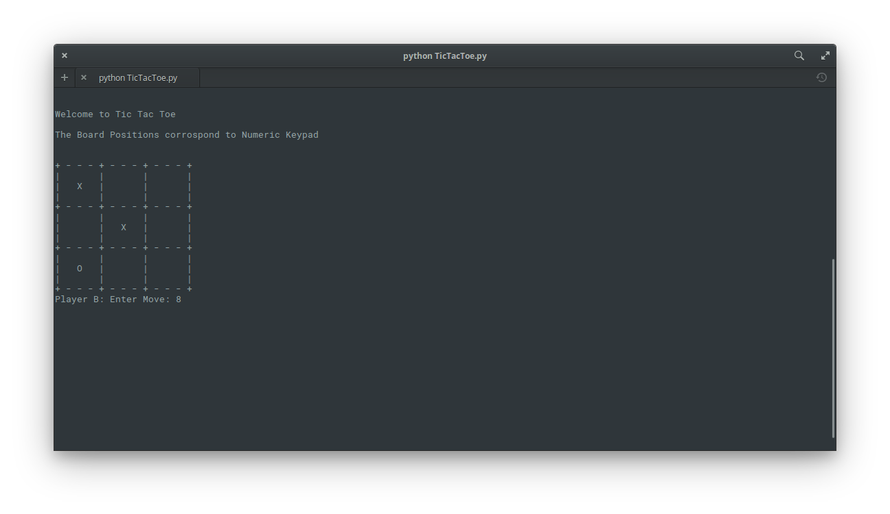

# TicTacToe

This is a Player vs Player command line version of the popular Tuc Tac Toe Game.

It allows players to choose their own markers ("X" or "O")
The First Player is Randomly choosed.

To Play this game run:
<code>python TicTacToe</code>

